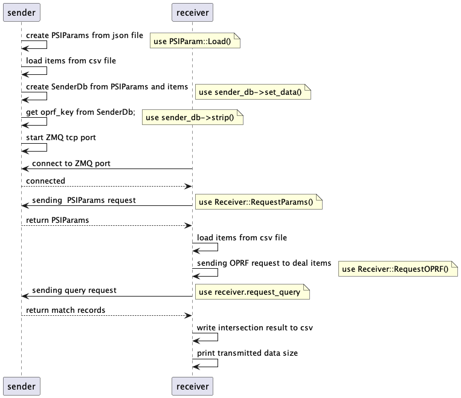

# Description


# Usage
## Timing Diagram



# Build

## Install Dependency

```
vcpkg install
```
## Build
```
cmake -B build -S . -DCMAKE_TOOLCHAIN_FILE={{VCPKG_ROOT}}/scripts/buildsystems/vcpkg.cmake
cmake --build build
```


# Benchmarks

## pir

| Receiver query size | Sender dataset size | Sender build bundleCache(Offline) | Communication size   | Query time |
|---------------------|---------------------|-----------------------------------|----------------------|------------|
| 1                   | 500000              | 12min                             | R->S: 926 KB<br/> S->R:6107 KB | 21s        |
| 10                  | 500000              | 12min                             | R->S: 927 KB<br/>  S->R:6108 KB             | 24s        |
| 500                 | 500000              | 12min                             | R->S: 929 KB<br/>  S->R:6111 KB             | 25s        |


